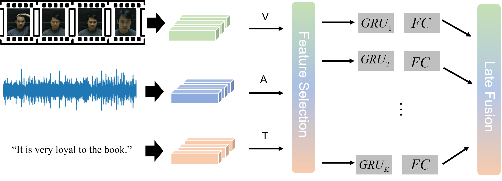

# MuSe2023-Personalisation Challenge

This is the source code for the paper

[Temporal-aware Multimodal Feature Fusion for Sentiment Analysis.](https://doi.org/10.1145/3606039.3613111) </br>
Qi Li, Shulei Tang, Feixiang Zhang, Ruotong Wang, Yangyang Xu, Zhuoer Zhao, Xiao Sun, Meng Wang </br>
Proceedings of the 4th on Multimodal Sentiment Analysis Challenge and Workshop: Mimicked Emotions, Humour and Personalisation. </br>



## Environment

This code is based on Python3.8 and Pytorch 1.12. Other packages in `requirements.txt`.

## Features

For the official multimodal features, please refer to [official support](https://www.muse-challenge.org/challenge/data). An extended of the visual features (VPT, APViT EmoNet, MVFace, EAC), we extract those features by employing the pre-trained models released by themselves. 
The detail feature extractor for VPT refers to [this link](https://github.com/KMnP/vpt), APViT referring to [this link](https://github.com/youqingxiaozhua/APViT), EAC referring to [this link](https://github.com/zyh-uaiaaaa/Erasing-Attention-Consistency), MVFace referring to [this link](https://github.com/xiaoboCASIA/SV-X-Softmax), EmoNet referring to [this link](https://github.com/face-analysis/emonet).
Please put the extracted features in the same directory as the official features.

## Training
For unimodal training, the following shows some of the parameter settings and corresponding results.

   ```shell
   -----------------------------Arousal-----------------------------------------
   python main.py --task personalisation --feature emonet --emo_dim physio-arousal --model_dim 256 --rnn_n_layers 2 --lr 0.001  --win_len 200 --hop_len 100 --rnn_dropout 0.
   python personalisation.py --model_id RNN_2023-06-14-17-11_[emonet]_[physio-arousal_False]_[256_2_False_64]_[0.001_256] --checkpoint_seed 3047 --emo_dim physio-arousal --lr 0.0005 --early_stopping_patience 10 --epochs 50 --win_len 20 --hop_len 10
   0.7063

   python main.py --task personalisation --feature emonet --emo_dim physio-arousal --normalize --model_dim 256 --rnn_n_layers 2 --lr 0.001  --win_len 200 --hop_len 100 --rnn_dropout 0.
   python personalisation.py --model_id RNN_2023-06-14-17-15_[emonet]_[physio-arousal_True]_[256_2_False_64]_[0.001_256] --normalize --checkpoint_seed 3049 --emo_dim physio-arousal --lr 0.0005 --early_stopping_patience 10 --epochs 50 --win_len 10 --hop_len 5
   0.8402
   
   python main.py --task personalisation --feature apvit --emo_dim physio-arousal --model_dim 128 --rnn_n_layers 4 --lr 0.005  --win_len 200 --hop_len 100 --rnn_dropout 0.5
   python personalisation.py --model_id RNN_2023-06-14-17-17_[apvit]_[physio-arousal_False]_[128_4_False_64]_[0.005_256] --checkpoint_seed 3049 --emo_dim physio-arousal --lr 0.002 --early_stopping_patience 10 --epochs 50 --win_len 20 --hop_len 10
   0.9433

   python main.py --task personalisation --feature apvit --emo_dim physio-arousal --normalize --model_dim 128 --rnn_n_layers 4 --lr 0.005  --win_len 200 --hop_len 100 --rnn_dropout 0.5
   python personalisation.py --model_id RNN_2023-06-14-17-22_[apvit]_[physio-arousal_True]_[128_4_False_64]_[0.005_256] --normalize --checkpoint_seed 3047 --emo_dim physio-arousal --lr 0.002 --early_stopping_patience 10 --epochs 50 --win_len 20 --hop_len 10
   0.8986
   
   python main.py --task personalisation --feature EAC --emo_dim physio-arousal --model_dim 128 --rnn_n_layers 4 --rnn_bi --lr 0.0005  --win_len 200 --hop_len 100 --rnn_dropout 0.
   python personalisation.py --model_id RNN_2023-06-14-17-25_[EAC]_[physio-arousal_False]_[128_4_True_64]_[0.0005_256] --checkpoint_seed 3049 --emo_dim physio-arousal --lr 0.002 --early_stopping_patience 10 --epochs 10 --win_len 20 --hop_len 10
   0.76

   python main.py --task personalisation --feature EAC --normalize --emo_dim physio-arousal --model_dim 128 --rnn_n_layers 4 --rnn_bi --lr 0.0005  --win_len 200 --hop_len 100 --rnn_dropout 0.
   python personalisation.py --model_id RNN_2023-06-14-17-37_[EAC]_[physio-arousal_True]_[128_4_True_64]_[0.0005_256] --normalize --checkpoint_seed 3048 --emo_dim physio-arousal --lr 0.002 --early_stopping_patience 10 --epochs 10 --win_len 20 --hop_len 10
   0.7201
   
   python main.py --task personalisation --feature affectnet7 --emo_dim physio-arousal --model_dim 256 --rnn_n_layers 1 --lr 0.001  --win_len 50 --hop_len 25 --rnn_dropout 0.5
   python personalisation.py --model_id RNN_2023-06-14-17-46_[affectnet7]_[physio-arousal_False]_[256_1_False_64]_[0.001_256] --checkpoint_seed 3047 --emo_dim physio-arousal --lr 0.0005 --early_stopping_patience 10 --epochs 50 --win_len 20 --hop_len 10
   0.8654

   python main.py --task personalisation --feature affectnet7 --emo_dim physio-arousal --normalize --model_dim 256 --rnn_n_layers 1 --lr 0.001  --win_len 50 --hop_len 25 --rnn_dropout 0.5
   python personalisation_earlyfusion.py --predict --feature affect7 --model_id RNN_2023-06-14-17-47_[affectnet7]_[physio-arousal_True]_[256_1_False_64]_[0.001_256] --normalize --checkpoint_seed 3048 --emo_dim physio-arousal --lr 0.001 --early_stopping_patience 10 --epochs 50 --win_len 10 --hop_len 5
   0.8590
   
   python main.py --task personalisation --feature mvface_1 --emo_dim physio-arousal --model_dim 128 --rnn_n_layers 4 --lr 0.005  --win_len 200 --hop_len 100 --rnn_dropout 0.5
   python personalisation_earlyfusion.py --feature mvface_1 --model_id RNN_2023-07-06-15-13_[mvface_1]_[physio-arousal_False]_[128_4_False_64]_[0.005_256] --checkpoint_seed 3051 --emo_dim physio-arousal --lr 0.005 --early_stopping_patience 10 --epochs 100 --win_len 20 --hop_len --predict
   0.9413

   python main.py --task personalisation --feature mvface --emo_dim physio-arousal --normalize --model_dim 128 --rnn_n_layers 4 --lr 0.005  --win_len 200 --hop_len 100 --rnn_dropout 0.5
   python personalisation.py --model_id RNN_2023-06-14-17-54_[mvface]_[physio-arousal_True]_[128_4_False_64]_[0.005_256] --normalize --checkpoint_seed 3050 --emo_dim physio-arousal --lr 0.001 --early_stopping_patience 10 --epochs 100 --win_len 20 --hop_len 10
   0.8808
   
   python main.py --task personalisation --feature egemaps --normalize --emo_dim physio-arousal --model_dim 256 --rnn_n_layers 4 --lr 0.002  --win_len 50 --hop_len 25 --rnn_dropout 0.5
   python personalisation.py --model_id RNN_2023-06-14-17-59_[egemaps]_[physio-arousal_True]_[256_4_False_64]_[0.002_256] --normalize --checkpoint_seed 3049 --emo_dim physio-arousal --lr 0.002 --early_stopping_patience 10 --epochs 20 --win_len 10 --hop_len 5
   0.9274
   
   python main.py --task personalisation --feature ds --emo_dim physio-arousal --model_dim 32 --rnn_n_layers 2 --lr 0.005  --win_len 200 --hop_len 100 --rnn_dropout 0.
   python personalisation.py --model_id RNN_2023-06-14-18-03_[ds]_[physio-arousal_False]_[32_2_False_64]_[0.005_256] --checkpoint_seed 3049 --emo_dim physio-arousal --lr 0.005 --early_stopping_patience 10 --epochs 20 --win_len 20 --hop_len 10
   0.7636
   
   python main.py --task personalisation --feature w2v-msp --emo_dim physio-arousal --model_dim 32 --rnn_n_layers 4 --rnn_bi --lr 0.005  --win_len 200 --hop_len 100 --rnn_dropout 0.5
   python personalisation.py --model_id RNN_2023-06-14-18-08_[w2v-msp]_[physio-arousal_False]_[32_4_True_64]_[0.005_256] --checkpoint_seed 3048 --emo_dim physio-arousal --lr 0.01 --early_stopping_patience 10 --epochs 10 --win_len 20 --hop_len 10
   0.9029
   
   python main.py --task personalisation --feature bert-4 --emo_dim physio-arousal --model_dim 128 --rnn_n_layers 4 --lr 0.005  --win_len 200 --hop_len 100 --rnn_dropout 0.5
   python personalisation_earlyfusion.py --model_id RNN_2023-07-05-15-53_[bert-4]_[physio-arousal_False]_[128_4_False_64]_[0.005_256] --checkpoint_seed 3050 --emo_dim physio-arousal --lr 0.002 --early_stopping_patience 10 --epochs 50 --win_len 20 --hop_len 10 --feature bert-4 --predict
   
   python main.py --task personalisation --feature mvface_1 --emo_dim physio-arousal --model_dim 128 --rnn_n_layers 4 --lr 0.005  --win_len 200 --hop_len 100 --rnn_dropout 0.5
   python personalisation_earlyfusion.py --feature mvface_1 --model_id RNN_2023-07-06-15-13_[mvface_1]_[physio-arousal_False]_[128_4_False_64]_[0.005_256] --checkpoint_seed 3051 --emo_dim physio-arousal --lr 0.005 --early_stopping_patience 10 --epochs 100 --win_len 20 --hop_len 10
   0.9413

   python main.py --task personalisation --feature mvface_2 --emo_dim physio-arousal --model_dim 128 --rnn_n_layers 4 --lr 0.005  --win_len 200 --hop_len 100 --rnn_dropout 0.5
   python personalisation_earlyfusion.py --feature mvface_2 --model_id RNN_2023-07-06-15-42_[mvface_2]_[physio-arousal_False]_[128_4_False_64]_[0.002_256] --checkpoint_seed 3055 --emo_dim physio-arousal --lr 0.005 --early_stopping_patience 10 --epochs 100 --win_len 20 --hop_len 10
   0.9413
   
   python main.py --task personalisation --feature bert-4_1 --emo_dim physio-arousal --model_dim 128 --rnn_n_layers 4 --lr 0.0047  --win_len 200 --hop_len 100 --rnn_dropout 0.5
   python personalisation_earlyfusion.py --feature bert-4_1 --model_id RNN_2023-07-06-16-37_[bert-4_1]_[physio-arousal_False]_[128_4_False_64]_[0.0047_256] --checkpoint_seed 3051 --emo_dim physio-arousal --early_stopping_patience 10 --epochs 50 --win_len 20 --hop_len 10 --lr 0.002
   0.37
 
   -----------------------------Valence-----------------------------------------
   
   python main.py --task personalisation --feature bert-4 --emo_dim valence --model_dim 128 --rnn_n_layers 4 --lr 0.005  --win_len 200 --hop_len 100 --rnn_dropout 0.5
   python main.py --task personalisation --feature bert-4 --normalize --emo_dim valence --model_dim 128 --rnn_n_layers 4 --lr 0.005  --win_len 200 --hop_len 100 --rnn_dropout 0.5
   python personalisation_earlyfusion.py --model_id RNN_2023-07-05-18-39_[bert-4]_[valence_False]_[128_4_False_64]_[0.005_256] --checkpoint_seed 3049 --emo_dim valence --lr 0.002 --early_stopping_patience 10 --epochs 50 --win_len 20 --hop_len 10 --feature bert-4
   python personalisation_earlyfusion.py --model_id RNN_2023-07-05-19-14_[bert-4]_[valence_True]_[128_4_False_64]_[0.005_256] --normalize --checkpoint_seed 3049 --emo_dim valence --lr 0.002 --early_stopping_patience 10 --epochs 50 --win_len 20 --hop_len 10 --feature bert-4
   
   python main.py --task personalisation --feature emonet --emo_dim valence --model_dim 128 --rnn_n_layers 4 --lr 0.0005  --win_len 200 --hop_len 100 --rnn_dropout 0.
   python personalisation.py --model_id RNN_2023-06-14-18-18_[emonet]_[valence_False]_[128_4_False_64]_[0.0005_256] --checkpoint_seed 3051 --emo_dim valence --lr 0.001 --early_stopping_patience 10 --epochs 50 --win_len 20 --hop_len 10
   0.4450

   python main.py --task personalisation --feature emonet --normalize --emo_dim valence --model_dim 128 --rnn_n_layers 4 --lr 0.0005  --win_len 200 --hop_len 100 --rnn_dropout 0.
   python personalisation.py --model_id RNN_2023-06-14-18-23_[emonet]_[valence_True]_[128_4_False_64]_[0.0005_256] --checkpoint_seed 3051 --normalize --emo_dim valence --lr 0.002 --early_stopping_patience 10 --epochs 50 --win_len 20 --hop_len 10
   0.8782
   
   python main.py --task personalisation --feature apvit --emo_dim valence --model_dim 128 --rnn_n_layers 4 --rnn_bi --lr 0.005  --win_len 200 --hop_len 100 --rnn_dropout 0.5
   python personalisation.py --model_id RNN_2023-06-14-18-27_[apvit]_[valence_False]_[128_4_True_64]_[0.005_256] --checkpoint_seed 3047 --emo_dim valence --lr 0.001 --early_stopping_patience 10 --epochs 50 --win_len 10 --hop_len 5
   0.8655

   python main.py --task personalisation --feature apvit --normalize --emo_dim valence --model_dim 128 --rnn_n_layers 4 --rnn_bi --lr 0.005  --win_len 200 --hop_len 100 --rnn_dropout 0.5
   python personalisation.py --model_id RNN_2023-06-14-18-34_[apvit]_[valence_True]_[128_4_True_64]_[0.005_256] --checkpoint_seed 3049 --normalize --emo_dim valence --lr 0.001 --early_stopping_patience 10 --epochs 50 --win_len 20 --hop_len 10
   0.7415
   
   python main.py --task personalisation --feature EAC --emo_dim valence --model_dim 128 --rnn_n_layers 4 --rnn_bi --lr 0.0005  --win_len 200 --hop_len 100 --rnn_dropout 0.
   python personalisation.py --model_id RNN_2023-06-15-14-48_[EAC]_[valence_False]_[128_4_True_64]_[0.0005_256] --checkpoint_seed 3048 --emo_dim valence --lr 0.0005 --early_stopping_patience 10 --epochs 50 --win_len 20 --hop_len 10
   0.5817

   python main.py --task personalisation --feature EAC --normalize --emo_dim valence --model_dim 128 --rnn_n_layers 4 --rnn_bi --lr 0.0005  --win_len 200 --hop_len 100 --rnn_dropout 0.
   python personalisation.py --model_id RNN_2023-06-15-14-56_[EAC]_[valence_True]_[128_4_True_64]_[0.0005_256] --checkpoint_seed 3051 --normalize --emo_dim valence --lr 0.002 --early_stopping_patience 10 --epochs 50 --win_len 10 --hop_len 5
   0.6940
   
   python main.py --task personalisation --feature affectnet7 --emo_dim valence --model_dim 128 --rnn_n_layers 4 --rnn_bi --lr 0.001  --win_len 200 --hop_len 100 --rnn_dropout 0.
   python personalisation.py --model_id RNN_2023-06-14-18-58_[affectnet7]_[valence_False]_[128_4_True_64]_[0.001_256] --checkpoint_seed 3048 --emo_dim valence --lr 0.001 --early_stopping_patience 10 --epochs 50 --win_len 20 --hop_len 10
   0.5224

   python main.py --task personalisation --feature affectnet7 --normalize --emo_dim valence --model_dim 128 --rnn_n_layers 4 --rnn_bi --lr 0.001  --win_len 200 --hop_len 100 --rnn_dropout 0.
   python personalisation_earlyfusion.py --predict --feature affect7 --model_id RNN_2023-06-14-19-04_[affectnet7]_[valence_True]_[128_4_True_64]_[0.001_256] --normalize --checkpoint_seed 3047 --emo_dim valence --lr 0.001 --early_stopping_patience 10 --epochs 50 --win_len 10 --hop_len 5
   0.8820
   
   python main.py --task personalisation --feature mvface --emo_dim valence --model_dim 128 --rnn_n_layers 2 --lr 0.005  --win_len 200 --hop_len 100 --rnn_dropout 0.
   python personalisation.py --model_id RNN_2023-06-16-21-25_[mvface]_[valence_False]_[128_2_False_64]_[0.005_256] --checkpoint_seed 3049 --emo_dim valence --lr 0.002 --early_stopping_patience 10 --epochs 100 --win_len 20 --hop_len 10
   0.7919

   python main.py --task personalisation --feature mvface --emo_dim valence --normalize --model_dim 128 --rnn_n_layers 2 --lr 0.005  --win_len 200 --hop_len 100 --rnn_dropout 0.
   python personalisation.py --model_id RNN_2023-06-16-21-31_[mvface]_[valence_True]_[128_2_False_64]_[0.005_256] --checkpoint_seed 3050 --normalize --emo_dim valence --lr 0.001 --early_stopping_patience 10 --epochs 100 --win_len 20 --hop_len 10
   0.7002
   
   python main.py --task personalisation --feature egemaps --normalize --emo_dim valence --model_dim 256 --rnn_n_layers 4 --lr 0.002  --win_len 200 --hop_len 100 --rnn_dropout 0.5
   python personalisation.py --model_id RNN_2023-06-14-19-21_[egemaps]_[valence_True]_[256_4_False_64]_[0.002_256] --normalize --checkpoint_seed 3051 --emo_dim valence --lr 0.001 --early_stopping_patience 10 --epochs 5 --win_len 20 --hop_len 10
   0.4366
   
   python main.py --task personalisation --feature ds --emo_dim valence --model_dim 64 --rnn_n_layers 2 --lr 0.001  --win_len 100 --hop_len 50 --rnn_dropout 0.
   python personalisation.py --model_id RNN_2023-06-14-19-25_[ds]_[valence_False]_[64_2_False_64]_[0.001_256] --checkpoint_seed 3048 --emo_dim valence --lr 0.001 --early_stopping_patience 10 --epochs 10 --win_len 20 --hop_len 10
   0.3343
   
   python main.py --task personalisation --feature w2v-msp --emo_dim valence --model_dim 128 --rnn_n_layers 4 --rnn_bi --lr 0.005  --win_len 100 --hop_len 50 --rnn_dropout 0.
   python personalisation.py --model_id RNN_2023-06-14-19-27_[w2v-msp]_[valence_False]_[128_4_True_64]_[0.005_256] --predict --keep_checkpoints --checkpoint_seed 3050 --emo_dim valence --lr 0.002 --early_stopping_patience 10 --epochs 20 --win_len 20 --hop_len 10
   0.8595
   
   python main.py --task personalisation --normalize --feature mvface_1 --emo_dim valence --model_dim 128 --rnn_n_layers 4 --lr 0.005 --win_len 200 --hop_len 100 --rnn_dropout 0.
   python personalisation_earlyfusion.py --feature mvface_1 --model_id RNN_2023-07-06-17-13_[mvface_1]_[valence_True]_[128_4_False_64]_[0.005_256] --normalize --predict --checkpoint_seed 3049 --emo_dim valence --lr 0.0083 --early_stopping_patience 10 --epochs 50 --win_len 20 --hop_len 10
   
   python main.py --task personalisation --feature affect7_1 --normalize --emo_dim valence --model_dim 128 --rnn_n_layers 4 --rnn_bi --lr 0.001  --win_len 200 --hop_len 100 --rnn_dropout 0.
   python personalisation_earlyfusion.py --feature affect7_1 --model_id RNN_2023-07-06-19-14_[affect7_1]_[valence_True]_[256_1_True_64]_[0.001_256] --normalize --checkpoint_seed 3049 --emo_dim valence --lr 0.001 --early_stopping_patience 10 --epochs 50 --win_len 10 --hop_len 5
   0.8820
   ```

2. For multimodal features and early fusion training, the following shows some of the parameter settings.

   ```shell
   #--------------------Valence------------------
   python main_earlyfusion.py --task personalisation --feature w2v-msp apvit --emo_dim valence --model_dim 128 --rnn_n_layers 4 --batch_size 64 --cache --lr 0.0005  --win_len 200 --hop_len 100 --rnn_dropout 0.
   python main_earlyfusion.py --task personalisation --feature w2v-msp affectnet7 --normalize --emo_dim valence --model_dim 128 --rnn_n_layers 4 --rnn_bi --lr 0.001  --win_len 200 --hop_len 100 --rnn_dropout 0.
   
   python main_earlyfusion.py --task personalisation --feature ds apvit --emo_dim valence --model_dim 128 --rnn_n_layers 4 --batch_size 64 --cache --lr 0.0005  --win_len 200 --hop_len 100 --rnn_dropout 0.
   python main_earlyfusion.py --task personalisation --feature ds affect7 --emo_dim valence --model_dim 128 --rnn_n_layers 4 --rnn_bi --lr 0.001  --win_len 200 --hop_len 100 --rnn_dropout 0.
   
   
   python main_earlyfusion.py --task personalisation --feature w2v-msp affectnet7 --normalize --emo_dim valence --model_dim 256 --rnn_n_layers 1 --batch_size 128 --cache --rnn_bi --lr 0.001  --win_len 200 --hop_len 100 --rnn_dropout 0.
   python main_earlyfusion.py --task personalisation --feature egemaps apvit --normalize --rnn_bi --emo_dim valence --model_dim 256 --rnn_n_layers 1 --batch_size 128 --cache --lr 0.001 --win_len 200 --hop_len 100 --rnn_dropout 0.
   
   python main_earlyfusion.py --task personalisation --feature egemaps apvit --emo_dim valence --model_dim 128 --rnn_n_layers 4 --batch_size 64 --cache --lr 0.0005  --win_len 200 --hop_len 100 --rnn_dropout 0.
   python main_earlyfusion.py --task personalisation --feature egemaps affectnet7 --normalize --emo_dim valence --model_dim 128 --rnn_n_layers 4 --rnn_bi --lr 0.001  --win_len 200 --hop_len 100 --rnn_dropout 0.
   
   # ------------------Arousal-----------------
   python main_earlyfusion.py --task personalisation --feature w2v-msp apvit --emo_dim physio-arousal --model_dim 128 --rnn_n_layers 4 --lr 0.005  --win_len 200 --hop_len 100 --rnn_dropout 0.5
   python main_earlyfusion.py --task personalisation --feature w2v-msp affect7 --emo_dim physio-arousal --model_dim 256 --rnn_n_layers 1 --lr 0.0008  --win_len 50 --hop_len 25 --rnn_dropout 0.5
   python main_earlyfusion.py --task personalisation --feature w2v-msp affectnet7 --emo_dim physio-arousal --model_dim 256 --rnn_n_layers 1 --lr 0.0035  --win_len 50 --hop_len 25 --rnn_dropout 0.5
   
   python main_earlyfusion.py --task personalisation --feature ds apvit --emo_dim physio-arousal --model_dim 128 --rnn_n_layers 4 --lr 0.005  --win_len 200 --hop_len 100 --rnn_dropout 0.5
   python main_earlyfusion.py --task personalisation --feature ds affect7 --emo_dim physio-arousal --model_dim 256 --rnn_n_layers 1 --lr 0.001  --win_len 50 --hop_len 25 --rnn_dropout 0.5
   
   python main_earlyfusion.py --task personalisation --feature egemaps apvit --emo_dim physio-arousal --model_dim 128 --rnn_n_layers 4 --lr 0.005  --win_len 200 --hop_len 100 --rnn_dropout 0.5
   python main_earlyfusion.py --task personalisation --feature egemaps affectnet7 --emo_dim physio-arousal --model_dim 256 --rnn_n_layers 1 --lr 0.0005  --win_len 200 --hop_len 100 --rnn_dropout 0.5
   ```

3. Using `late_fusion_feature_select.vis.py` for visualization， `fusion_a.py` and `fusion_v.py` for averaging the fusion results.

## Contact
If you have any problems or any further interesting ideas with this project, feel free to contact me (tangshulei120@gmail.com or liqi@stu.ahu.edu.cn).

## If you use this work, please cite our paper

    @inproceedings{10.1145/3606039.3613111,
	author = {Li, Qi and Tang, Shulei and Zhang, Feixiang and Wang, Ruotong and Xu, Yangyang and Zhao, Zhuoer and Sun, Xiao and Wang, Meng},
	title = {Temporal-Aware Multimodal Feature Fusion for Sentiment Analysis},
	year = {2023},
	publisher = {Association for Computing Machinery},
	doi = {10.1145/3606039.3613111},
	booktitle = {Proceedings of the 4th on Multimodal Sentiment Analysis Challenge and Workshop: Mimicked Emotions, Humour and Personalisation},
	pages = {99–105},
	numpages = {7},
	series = {MuSe '23}
	}
